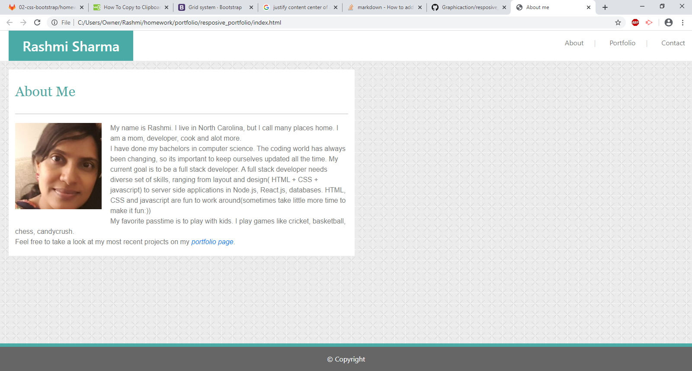

# portfolio
# The Repository
This repository is about my portfolio. It is responsive in nature for large, medium and small screens. 

## Installation:
This project uses HTML and CSS with Bootstrap.
The code editor used here is VScode. 

## Usage:
- Clean and informative portfolio so that one can learn about the developer, find contact information, and follow links to projects and repositories. Some of the screens are:
    - **About me**: Information about the developer .
    - **Portfolio**: Showing featured projects .
    - **Contact**: Contact form to the developer.

## Deployed link:
- https://graphicaction.github.io/resposive_portfolio/

## Credits:
UNC Chapelhill

## License
Copyright (c). All rights reserved.